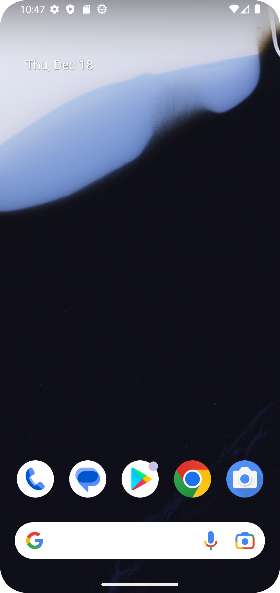

# Internship LMS Android Application

## Description
This is a basic Android application created as part of an internship assessment.
The app runs successfully on an Android emulator and demonstrates a working
Android project setup.

## Tech Stack
- Android Studio
- Java
- XML
- Gradle

## Setup Steps
1. Clone the repository
2. Open the project in Android Studio
3. Sync Gradle
4. Run the app on an emulator or physical device

## Screenshots

## Testing
- App tested on Android Emulator (Pixel 4 API 33)

## APK Download
APK file:  
(https://drive.google.com/file/d/1msW2BmYNWEat5GhaRRLqTzB9__kLnK6P/view?usp=sharing)
